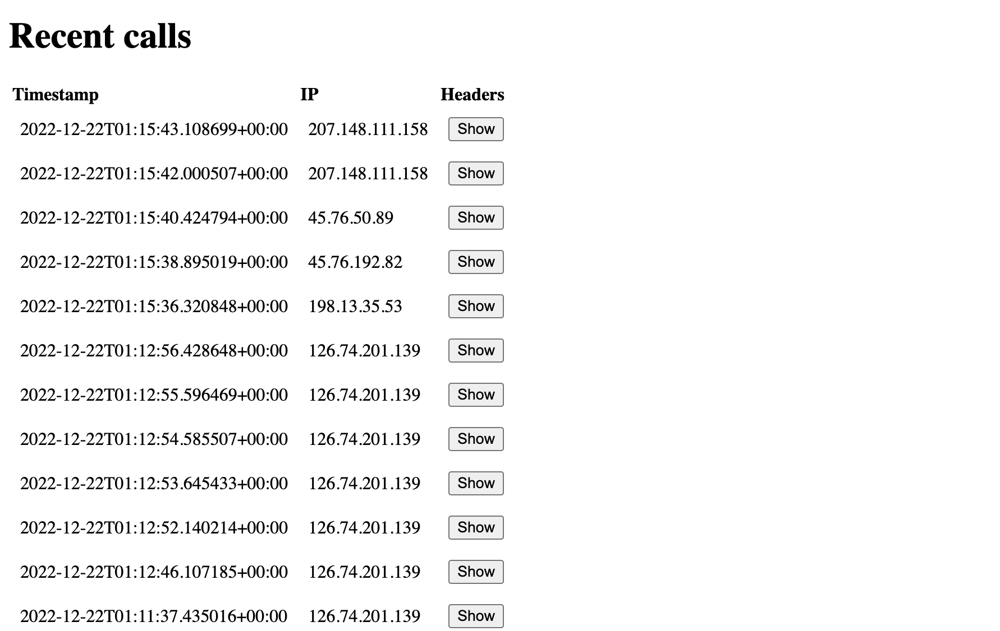

# Scraper Proxy Example

Example of how to use Scrapy with a rotating proxy, a test project which you can run your test against as well.

## Run the project

You will need a Vercel project to connect it with for the API to work and that project also needs to have two environment settings defined:

- `SUPABASE_URL` for your supabase account
- `SUPABASE_KEY` for the token

Then you can run `npx vercel dev` in the root folder of the project. That will build and run both the VueJS app and the backend functions in `web/api/` folder.

## Usage

- Web: [Vite](https://vitejs.dev/) + [VueJs](https://vuejs.org/)
- API & Hosting: [Vercel](https://vercel.com/)
- Database: [Supabase](https://supabase.com/)